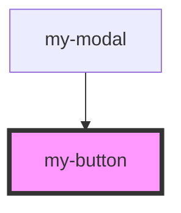

# my-button

<!-- Auto Generated Below -->

## Properties

| Property     | Attribute      | Description | Type     | Default     |
| ------------ | -------------- | ----------- | -------- | ----------- |
| `btnBgColor` | `btn-bg-color` |             | `string` | `undefined` |
| `btnColor`   | `btn-color`    |             | `string` | `undefined` |
| `btnText`    | `btn-text`     |             | `string` | `undefined` |

## Events

| Event        | Description | Type               |
| ------------ | ----------- | ------------------ |
| `checkEvent` |             | `CustomEvent<any>` |

## Dependencies

### Used by

 - [my-modal](../my-modal)

### Graph

----------------------------------------------

*Built with [StencilJS](https://stenciljs.com/)*
